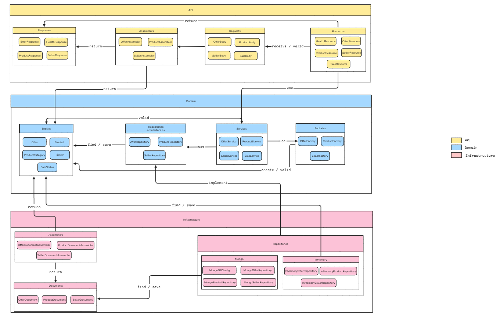

# floppa-project

A team-built marketplace backend developed as part of the GLO-2003 Software Engineering Processes course at Université Laval (Winter 2026).

The API manages sellers, products, offers, and sales. Built with an emphasis on software engineering practices: TDD, clean code, CI/CD, and real team collaboration workflows.

> The original course repository is private. This mirror contains only this README and the architecture diagram.

---

## Architecture



Three strict layers — no dependency leaks between them:

- **API** — Jersey resources, request/response models, assemblers, exceptions, exceptionsMappers. Stays thin: HTTP handling, delegation, response construction.
- **Domain** — Business logic, entities, services, factories, repository interfaces, exceptions. Never depends on persistence.
- **Infrastructure** — MongoDB via Morphia. Two implementations per repository: `InMemory` (tests) and `Mongo` (production), selected at startup via system property.

---

## Endpoints

| Method | Route | Description |
|--------|-------|-------------|
| `POST` | `/sellers` | Create a seller |
| `GET` | `/sellers/{sellerId}` | Get a seller with their products and offer stats |
| `POST` | `/sellers/{sellerId}/products` | Create a product |
| `GET` | `/products/{productId}` | Get a product with its seller and offer stats |
| `POST` | `/products/{productId}/offers` | Submit an offer on a product |
| `GET` | `/sellers/{sellerId}/offers` | Get all offers received by a seller |
| `GET` | `/sellers/{sellerId}/offers/stats` | Get offer statistics for a seller |
| `POST` | `/products/{productId}/sales` | Create a sale from an offer |
| `PUT` | `/sellers/{sellerId}/rating` | Rate a seller |

---

## Tech Stack

**Backend**
- Java 21, Jersey (JAX-RS), MongoDB, Morphia

**Testing**
- JUnit 5, Mockito, Testcontainers
- Unit tests (Mockito) · Integration tests (Testcontainers — real MongoDB instance)

**DevOps**
- Docker, GHCR, GitHub Actions (CI/CD)

**Practices**
- TDD, Clean Code, Jakarta Bean Validation
- Conventional commits & branch naming
- PR reviews enforced via branch protection (CI must pass + 1 approval)
- GitHub Projects — issues, milestones, backlog
- `CONTRIBUTING.md`, `CODE_OF_CONDUCT.md`, `LICENSE` (open-source contribution simulation)

---

## Project Structure

```
src/
├── main/java/
│   ├── api/               # Resources, assemblers, request/response models
│   ├── domain/            # Entities, services, repository interfaces
│   └── infrastructure/    # Morphia documents, MongoDB repositories
├── test/java/
│   ├── api/
│   ├── domain/
│   └── infrastructure/
.gitignore
Dockerfile
docker-compose.yml
README.md
```

---

## CI/CD

Two GitHub Actions pipelines:

- **CI** — runs on every push: compiles, unit tests, integration tests
- **CD** — runs on merge to `main`: builds and pushes Docker image to GHCR

---

## Contributors

University team project — GLO-2003, Université Laval.

- **[Petiton Wiseley Paul-Enzer](https://github.com/pwiseley)**
- **[Ouedraogo Aliya Imann](https://github.com/aioue8)**
- **[Dongmeza Murielle Christelle](https://github.com/muriellec)**
- **[Guerby Benoit](https://github.com/guben18)**
- **[Mamoudou Hamadou Mamoudou Hamadou](https://github.com/mamoudouhamadou)**

---

*[petiton.dev](https://petiton.dev)*